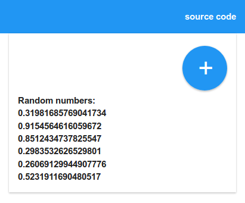

This is an experiment to see how small and fast an interactive single-page web application written in LISP can be.

According to [webpagetest.org](https://www.webpagetest.org/result/171103_6G_c1b547f215b64acf122c6269b2895e45/) time-to-interact with all content fully loaded is under 500ms (half a second).

Source code in [main.wisp](./main.wisp) with a [Makefile](./Makefile) for building.

## How

 * Compile [Wisp](http://www.jeditoolkit.com/wisp/) source into concise native JS.
 * Inline `styles.css` and resulting `main.js` into [index.template.html](./index.template.html) using [gpp](https://github.com/logological/gpp).
 * Minify resulting HTML artifact including CSS & JS using [html-minifier](https://github.com/kangax/html-minifier).
 * [mithril.js](https://mithril.js.org/) for rendering.
 * Styles from [MUI CSS](https://www.muicss.com/) with [CSS Used](https://chrome.google.com/webstore/detail/css-used/cdopjfddjlonogibjahpnmjpoangjfff?hl=en) plugin to extract only the rules used.

## Build

`make` will build into the `build` folder.
